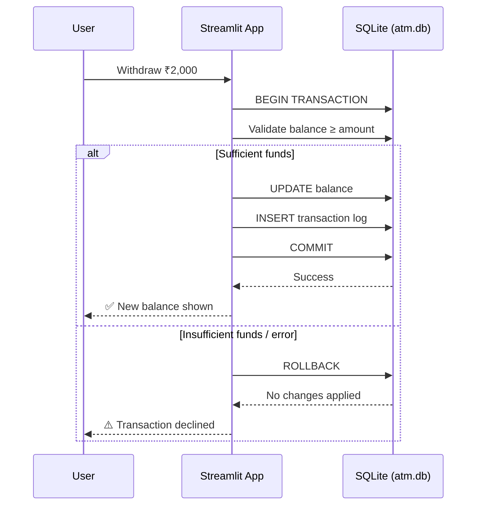

<div align="center">


<br/>

[](https://www.python.org/)
[](https://streamlit.io/)
[](https://www.sqlite.org/)
[](LICENSE)
[]()


<br/>


<br/><br/>

**[✨ Highlights](#-features--highlights)** &nbsp;•&nbsp;
**[📸 Interfaces](#-key-interfaces)** &nbsp;•&nbsp;
**[🛠 Tech Stack](#%EF%B8%8F-tech-stack--concepts)** &nbsp;•&nbsp;
**[🚀 Quick Start](#-quick-start-guide)** &nbsp;•&nbsp;
**[🧪 Testing](#-automated-testing)** &nbsp;•&nbsp;
**[🛡️ Security](#%EF%B8%8F-security--reliability-features)**

</div>

<br/>

## 📌 Overview

A high-fidelity, portfolio-ready **ATM Simulation and Digital Banking Application**
built with **Python**, **Streamlit**, **SQLite**, and **Object-Oriented
Programming (OOP)**. The project ships **two** complete interfaces — a modern
web-based banking dashboard with a luxury fintech design system, and a
full-featured terminal CLI — backed by the same atomic, transaction-safe data
layer underneath.

<br/>

## 💡 Why This Project Stands Out

<table>
<tr>
<td align="center" width="25%">⚡<br/><b>ACID Transactions</b><br/><sub>Atomic commit/rollback, no desync</sub></td>
<td align="center" width="25%">🖥️<br/><b>Dual Interface</b><br/><sub>Web dashboard + terminal CLI</sub></td>
<td align="center" width="25%">🧪<br/><b>27 Unit Tests</b><br/><sub>Domain, DB & CLI coverage</sub></td>
<td align="center" width="25%">🎨<br/><b>Fintech Design</b><br/><sub>Custom glassmorphism CSS system</sub></td>
</tr>
</table>

<br/>

## 📸 Key Interfaces

- **🖥️ Web GUI (Streamlit)** — high-contrast fintech dashboard featuring balance
  hero cards, instant transaction presets, interactive statements, and
  real-time security alerts.
- **⌨️ Terminal CLI (Command Line)** — full console-based ATM experience with
  interactive menus, masked PIN inputs, and tabular receipts.

> *(Add screenshots of the dashboard and CLI here — e.g.
> `assets/screenshots/dashboard.png` and `assets/screenshots/cli.png` — a
> visual of the balance hero card and glassmorphism styling sells this
> project immediately.)*

<br/>

## 🌟 Features & Highlights

### 💳 Core Banking Operations
- **🔐 Secure PIN authentication** — 4-digit numeric PIN authentication with validation, error handling, and session state protection
- **💰 Real-time balance tracking** — instant balance inquiries displayed via a luxury debit card component with auto-sync indicators
- **📈 Financial insights & analytics** — real-time summary metrics tracking lifetime deposits, total cash withdrawals, and logged transaction events
- **💵 Quick & custom deposits** — instant preset deposit buttons (`₹500`, `₹1,000`, `₹2,000`, `₹5,000`) and custom amount inputs with atomic balance synchronization
- **💸 Safe cash withdrawals** — real-time balance validation, insufficient funds warnings, denomination guidelines, and atomic deductions
- **🧾 Comprehensive transaction history** — reverse-chronological transaction statements with color-coded badges (`+` green for deposits, `-` red for withdrawals), post-transaction balances, and ISO timestamps
- **🔑 Self-service PIN management** — PIN change flow with current PIN authentication, 4-digit numeric validation, and match confirmation

### 🛡️ Enterprise Architecture & Security
- **⚡ ACID atomic transactions** — database balance updates and transaction logging execute within atomic `BEGIN TRANSACTION`, `COMMIT`, and `ROLLBACK` blocks to prevent desynchronization
- **🔒 SQL injection prevention** — all database queries use parameterized SQL placeholders (`?`)
- **🔗 Relational data integrity** — SQLite foreign key constraints (`PRAGMA foreign_keys = ON;`) enforced across accounts and transactions
- **🎨 Custom fintech design system** — pure CSS design tokens (`style.css`), Inter typography, glassmorphism cards, glowing pulse indicators, and responsive mobile breakpoints

<br/>

## 🧬 How a Transaction Stays Safe



This is the core guarantee of the whole system: **a balance update and its
transaction log entry either both happen, or neither does** — there's no state
where money moves but the receipt doesn't get written, or vice versa.

<br/>

## 🏗️ Project Architecture & File Structure

```
ATM-Simulation/
│
├── app.py                 # Streamlit Web Application (Frontend & Routing Controller)
├── style.css              # Custom Fintech Design System (CSS3 Styles & Animations)
├── main.py                # Terminal CLI Application Entrypoint
├── atm.py                 # Terminal ATM Controller & Interactive Menu Logic
├── account.py             # Domain Model & Banking Business Logic
├── database.py            # SQLite Persistence Layer & Atomic Transactions
├── atm.db                 # Persistent SQLite Database (Auto-generated on first run)
│
├── tests/                 # Automated Unit Testing Suite (27 Test Cases)
│   ├── __init__.py
│   ├── test_account.py    # Account Model & Validation Tests
│   ├── test_database.py   # SQLite Transactions & Atomicity Tests
│   └── test_atm.py        # CLI ATM Interface Tests
│
├── pyrefly.toml           # Project Configuration
├── README.md              # Project Documentation
├── .gitignore             # Git Ignore Configuration
└── LICENSE                # MIT License
```

<br/>

## 🛠️ Tech Stack & Concepts

| Component | Technology / Pattern |
|---|---|
| **Language** | Python 3.8+ (Type-hinted, PEP 8 compliant) |
| **Web Framework** | Streamlit |
| **Styling** | Custom CSS3 (`style.css`), Google Inter Fonts, Flexbox/Grid |
| **Database** | SQLite3 (embedded, persistent relational storage) |
| **Design Paradigm** | Object-Oriented Programming (OOP) & Domain-Driven Design |
| **Testing** | Python standard `unittest` framework |

<br/>

## 🚀 Quick Start Guide

<details open>
<summary><b>1️⃣ Clone the repository</b></summary>

```bash
git clone https://github.com/tusharmagar1/atm-simulation-python.git
cd ATM-Simulation
```
</details>

<details open>
<summary><b>2️⃣ Install dependencies</b></summary>

Ensure Python is installed, then install Streamlit:
```bash
pip install streamlit
```
</details>

<details open>
<summary><b>3️⃣ Launch the web application</b></summary>

```bash
streamlit run app.py
```
> The web app will launch automatically at **`http://localhost:8501`**.
</details>

<details>
<summary><b>4️⃣ Launch the terminal CLI (optional)</b></summary>

```bash
python main.py
```
</details>

<br/>

## 🔑 Default Credentials

The database is pre-seeded with a default demo account upon first launch:

| Credential | Default Value |
|---|---|
| **Account ID** | `ACC-0001` (ID: `1`) |
| **Default Security PIN** | `1234` |
| **Initial Starting Balance** | `₹10,000.00` |

<br/>

## 🧪 Automated Testing

The project includes an automated test suite containing **27 unit tests**
covering the domain layer, database persistence, transaction rollbacks, and
CLI menus.

Run all tests from the root directory:
```bash
python -m unittest discover tests -v
```

### Test Coverage Highlights
- ✅ **`test_account.py`** — initial balance integrity, positive deposits, zero/negative rejection, insufficient funds handling, and PIN update validations
- ✅ **`test_database.py`** — SQLite schema creation, default seeding, parameterized updates, atomic rollbacks on failure, and persistence across reconnects
- ✅ **`test_atm.py`** — CLI login authentication, masked PIN input, withdrawal/deposit workflows, and balance inquiries

<br/>

## 🛡️ Security & Reliability Features

1. **Foreign key enforcement** — `PRAGMA foreign_keys = ON;` is enforced on every database connection
2. **Transaction rollback protection** — if any error occurs while logging a transaction, the entire transaction is rolled back so balances never go out of sync
3. **Floating point rounding** — monetary amounts are rounded to 2 decimal places to eliminate floating point imprecision
4. **Auto-recovery** — if `atm.db` is deleted or corrupted, the system automatically recreates tables and seeds the default demo account on startup

<br/>

## 📈 Roadmap

- [ ] Multi-account support with account switching
- [ ] Transaction export (CSV/PDF statement download)
- [ ] Interest-bearing savings account simulation
- [ ] Dockerized deployment
- [ ] Role-based admin panel for account management

<br/>

## 🤝 Contributing

Contributions, issues, and feature requests are welcome! Feel free to check the
[issues page](https://github.com/tusharmagar1/atm-simulation-python/issues).

<br/>

## 📄 License

Distributed under the **MIT License**. See [`LICENSE`](LICENSE) for details.

<br/>

## 👤 Author

<div align="center">

### Tushar Magar

[](https://github.com/tusharmagar1)
[](https://www.linkedin.com/in/tushar-magar-7b80a2255)

### ⭐ Support

If you found this project useful, consider giving it a star on GitHub.


</div>
